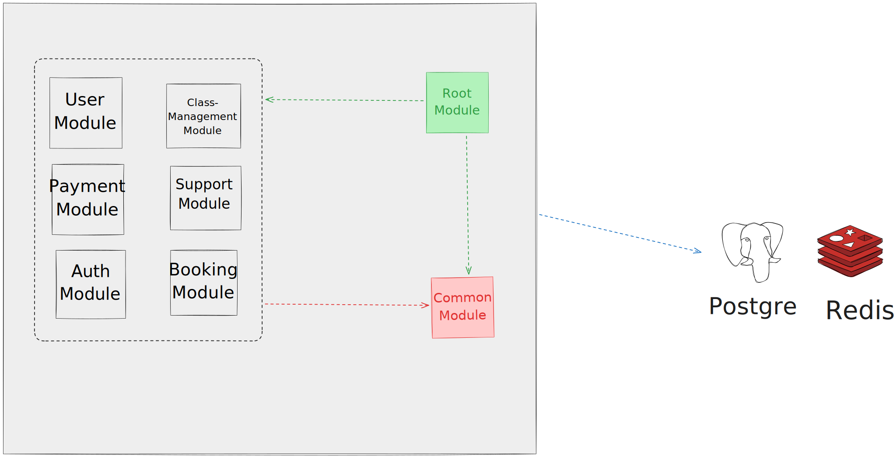
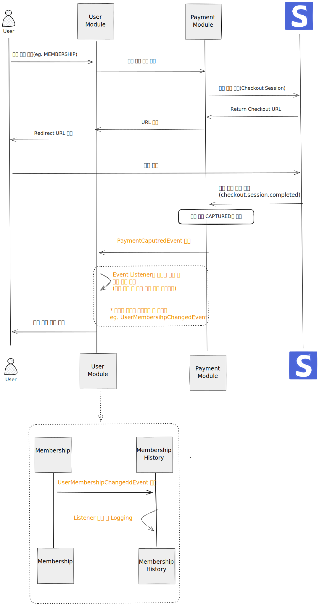
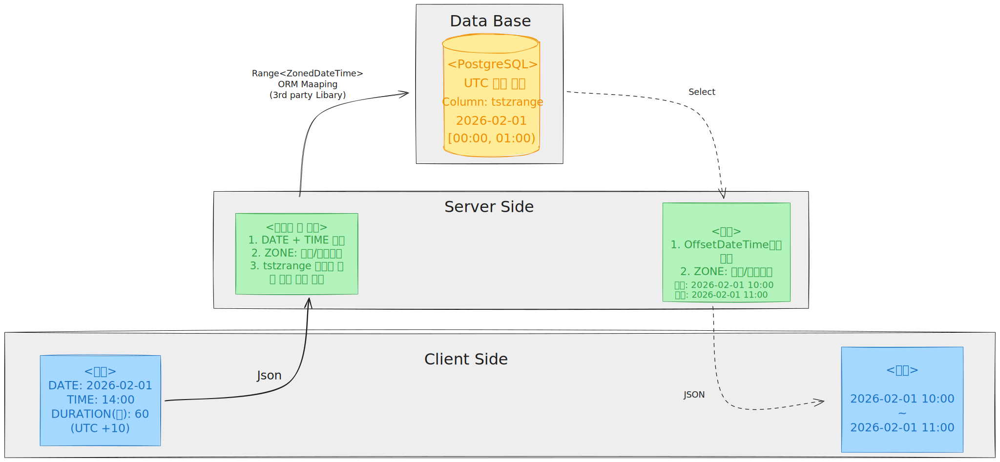

# 소규모 개인 체육관 관리 시스템
> **호주 브리즈번 위치를 기반으로 만든 모듈러 모놀리식 기반 체육관 관리 시스템**

 

##  프로젝트 개요
| 항목         | 내용                                                                                                                                                                         |
|:-----------|:---------------------------------------------------------------------------------------------------------------------------------------------------------------------------|
| **목표**     | 1. 호주 로컬 비지니스 환경을 수용하는 체육관 관리 솔루션 구축 합니다. 2. 단일 Spring Boot 기반의 Modular Monolith 아키텍처를 채택하여, 초기 배포 및 운영의 단순함을 유지하면서도 내부 도메인 간 독립성을 확보하여 향후 시스템 확장에 유연하게 대응할 수 있어야 합니다. |
| **개발 기간**  | 2025.09 ~ 2026.01 (개인 프로젝트)                                                                                                                                                |
| **주요 기술**  | Java 17, Spring Boot 3.5.x, JPA, PostgreSQL, Stripe API, Redis, Spring Events                                                                                              |

 

##  프로젝트 소개
본 프로젝트는 체육시설의 운영 신뢰성 확보를 위해, 실제 체육 시설 운영 현장의 고민을 해결하는데 집중한 관리 시스템입니다.
특히 모듈러 모놀리식 아키텍쳐를 채택하여 단순하면서 확장에 유연하게 대응할 수 있는 구조를 적용했습니다.
모든 비지니스 현장에서 데이터 변경 이력이 핵심 자산이라는 점에 착안하여, 실제 체육관 환경에서  발생할 수 있는 주요 기능에 대한 Audit Trail 시스템을 구축하였습니다. 

###  주요 기능
* **원활한 수업 예약**: 호주(Brisbane) 현지 시간 정책을 준수합니다. UTC 기반의 시스템 설계를 통해 지역시간 변동에도 오차 없는 예약/취소 로직을 제공하며, 무료/유료 세션별로 차등화된 예약 마감 정책을 적용했습니다.
* **신뢰성 있는 결제**: Stripe API 및 Webhook을 연동하여 글로벌 결제 정합성을 보장합니다. 상품 구매부터 환불(전액/부분/불가)까지의 복잡한 정책을 구현, 결제 실패 시 즉각적인 복구 프로세스를 갖추었습니다.
* **추적성 확보**: 시스템 내에서 발생하는 예약, 수업, 결제의 모든 행위를 로깅합니다. 관리자가 전체 비즈니스 흐름을 투명하게 모니터링할 수 있는 기반을 마련했습니다.

###  사용자
* **관리자(Admin)**: 결제 이력, 수업 현황, 예약 로그를 모니터링하며 시스템 전반의 추적 감사를 수행합니다. (Phase 2 개발 예정)
* **트레이너(Trainer)**: 수업 템플릿 및 정기 수업(커리큘럼/루틴)을 등록하고, 회원의 예약 현황을 관리하며 필요 시 예약을 강제 취소할 수 있는 권한을 가집니다.
* **정회원(Member)**: 멤버십 상품을 구매한 사용자로, 그룹 수업 및 1:1 PT 수업을 자유롭게 예약/취소하고 본인의 운동 스케줄을 관리합니다.
* **일반 회원(Guest)**: 회원가입 시 지급되는 '최초 1회 무료 PT 체험권'을 통해 예약 서비스를 체험할 수 있으며, 상품 구매를 통해 정회원으로 전환이 가능합니다.

### 요구사항 정의서
**[요구사항 정의서 상세 보기](./요구사항정의서.md)** 

## 기술 스택
### Backend

###  Database & Cache

###  External API & Tools

 

##  전략 사항

### 1 . 글로벌 타임존(Australia/Brisbane) 정합성 확보
* **Issue**: 개발환경과 실제 서비스 지역의 시차로 인한 예약 시간 오류 방지 필요
* **Solution**: 시스템의 모든 시간 기준점을 UTC($+00:00$)로 단일화하여 환경 독립적인 설계를 구축하고, 비즈니스 규칙만 현지 타임존을 적용.

### 2. Stripe 결제 무결성 및 멱등성 보장
* **Issue**: 결제 완료 후 사용자 이탈(브라우저 종료 등) 시 수강권 미발급 위험 및 중복 결제 처리 이슈.
* **Solution**: **Stripe Webhook**을 도입하여 결제 결과를 비동기적으로 수신. Stripe에서 내려주는 고유번호로 상태를 추적하여, 이미 처리된 결제를 중복으로 시도하지 못하게 보호하였습니다.

### 3. 유연한 수업 모델링 및 스케줄링
* **Issue**: 특정 기간 동안 진행되는 수업(커리큘럼형, 루틴형)과 일회성 수업을 하나의 시스템에서 효율적으로 관리해야함.
* **Solution**: 
* Template(수업정의) : 수업의 이름, 설명, 소요 시간, 인원을 관리합니다.
* Recurrence(반복 규칙): 매주 반복요일, 수업타입(커리큘럼형, 루틴형), 예약 가능 상태 등을 관리합니다.
* Schedule(실제 일정): 규칙에 의해 생성된 개별 수업 인스턴스, 특정 날짜의 수업을 관리합니다.
    
### 4. 모듈 간 결합도 분리 (Modular Monolith)
* **Issue**: 모듈간 직접적인 참조로 인한 의존성이 없이 기능을 수행해야함.
* **Solution**: 
  * Port/Adapter: 실시간 데이터 조회가 필요하거나 비즈니스 로직상 즉각적인 정보 공유가 필수적인 경우, 인터페이스(Port)를 통한 간접 참조 구조를 설계하여 도메인 간의 물리적 결합을 방지했습니다.
  * Event-Driven: 각 모듈이 서로의 내부 로직을 알 필요 없이 독립적으로 동작하게 했습니다.

 

##  아키텍쳐

###  결제 예시

###  시간 변환

### DB ERD

 

##  향후 계획
현재 프로젝트는 다음과 같은 향후계획을 갖고 있습니다.

- **도메인 간 환불 책임 분리**: 결제 모듈 주도의 환불 로직을 유저 모듈로 이관하여 독립성 강화
- **관리자용 대시보드 구축**: 예약 현황 및 매출 분석 통계 UI 구축
- **예약 시스템 동시성 제어**: Redis를 활용한 수업 예약 동시성 제어 로직 최적화
- **용어 정리 및 통일**: 파편화 된 용어 정의 필요

##  연락처
* **이메일**: [stravinskky@naver.com]
